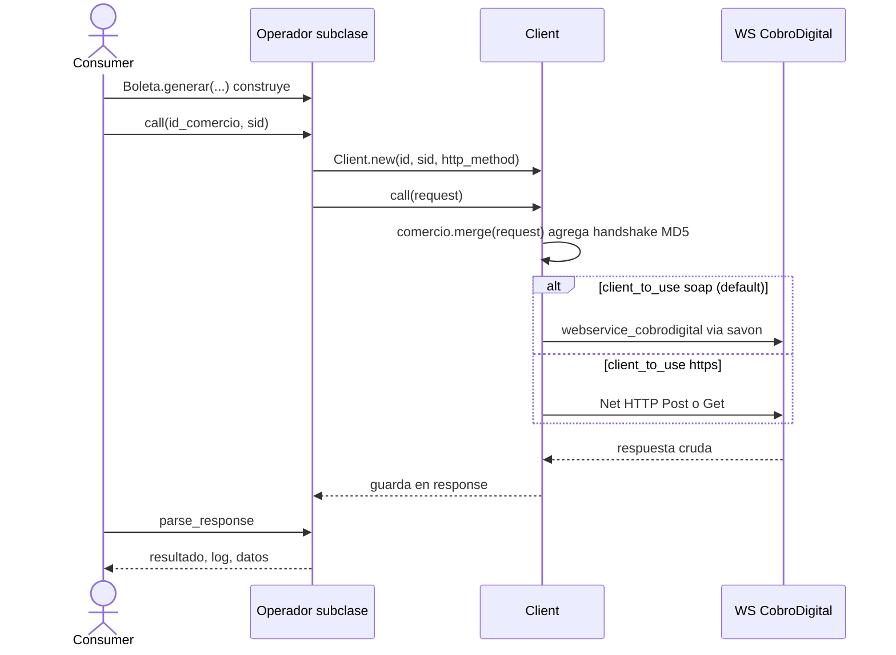
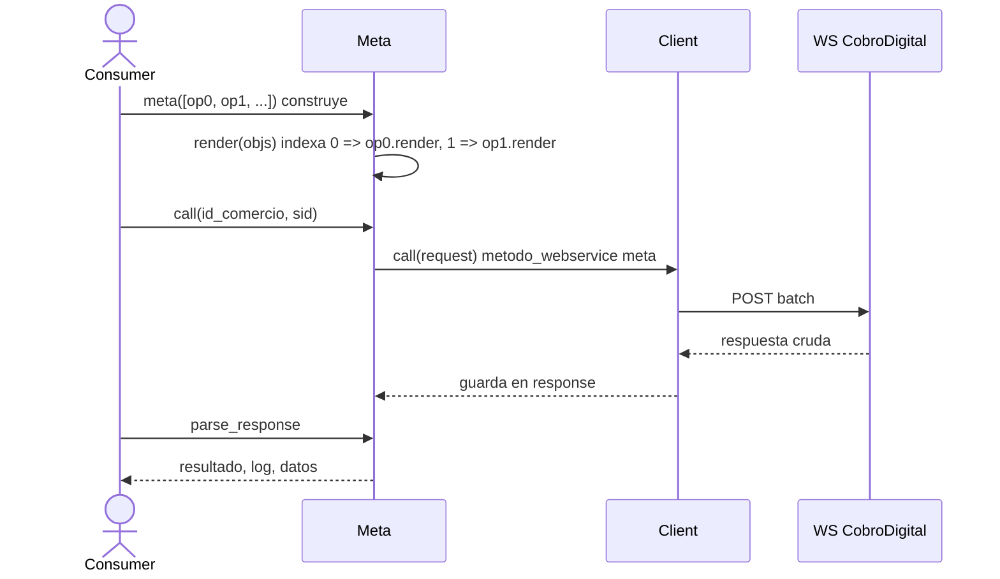

# Comportamiento — cobro_digital

> meta: artefacto · RFC-007 · generado arch-enrich · anclado a v1.9.0 · cobertura: 2 flujos documentados; ausencia ≠ inexistencia

## 1. Resumen

Dos flujos cubren el comportamiento de la gema: la **operación simple** (construir → `call` → `parse_response`) y el **batch meta** (agrupar N operaciones en una llamada). Ambos terminan en el mismo transporte `Client#call`.

## Cobertura

| flujo | estado |
|---|---|
| operación simple (cualquier subclase de `Operador`) | **documentado** |
| batch `meta` | **documentado** |
| selección de transporte SOAP vs HTTPS (interno a `Client`) | **documentado** (en flujo 1) |
| manejo de error de transporte | parcial — propaga sin envolver (ver `docs/consumed §d`) |

## 2. Flujos

### 2.1 Operación simple

El consumidor construye una operación con un método de clase, la ejecuta con `#call(id, sid)` y decodifica con `#parse_response`. `Client#call` mergea el bloque de comercio (con handshake) y despacha al transporte elegido.

**Contexto:** `parse_response` decodifica el JSON de `output`, evalúa `ejecucion_correcta == '1'` y aplana `datos`. No levanta excepción ante `resultado: false` (`lib/cobro_digital/operador.rb:22`).

### 2.2 Batch meta

`Meta.meta` toma una lista de operaciones ya construidas y las indexa en un único payload. Cada sub-operación conserva su `metodo_webservice`. Se ejecuta como una sola llamada POST.

**Contexto:** `Meta.transaction` es un helper que pre-arma una `Transaccion.consultar` con filtro tipo=ingreso por default (`lib/cobro_digital/meta.rb:42`).

## 3. Inferencias

| inferencia | confidence | a verificar |
|---|---|---|
| el batch `meta` se procesa server-side como unidad (atomicidad) | unknown | el código no lo expresa; preguntar a CobroDigital |
| la selección GET vs POST por operación es exigida por el WS | inferred | cada constructor fija `http_method`; confirmar que el WS lo requiere así |

## 4. Cobertura y fronteras

- **Cobertura:** 2 flujos, los dos caminos de ejecución reales de la gema.
- **No documentado:** el procesamiento interno del WS (caja negra del proveedor); el manejo de reintentos/timeout en degradación → `docs/consumed §c/§e`.
- **Mermaid:** diagramas pasados por el checklist render-safe (sin `;`, sin `::` en mensajes, un solo `:` por mensaje, ids no reservados).
