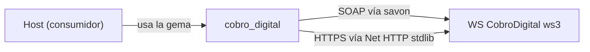

# Topología — cobro_digital

> meta: artefacto · RFC-006 · generado arch-structure · anclado a v1.9.0 · cobertura total de deps declaradas

## 1. Resumen

Gema-adaptador de un solo salto: el consumidor la usa para hablar con el WS externo de CobroDigital. Una dependencia de runtime (`savon`) para el transporte SOAP; el transporte HTTPS alternativo usa `Net::HTTP` de la stdlib. **No depende de ActiveSupport** (desde v1.9.0 usa solo stdlib).

## 2. §a Dependencias

| nombre | versión | rol |
|---|---|---|
| `savon` | `~> 2.12.1` | runtime — cliente SOAP hacia el WS (`Client#soap_client`) |
| `net/http` · `uri` · `digest` · `json` | stdlib Ruby | runtime — transporte HTTPS, parseo de URI, handshake MD5, (de)serialización JSON (requeridos explícitamente en `lib/cobro_digital.rb`) |
| `rake` | `>= 13.2.1` | desarrollo |
| `rspec` | `~> 3.13` | desarrollo (suite) |

> **Ruby:** `required_ruby_version = ['>= 2.7', '< 3.0']` — el stack `savon ~> 2.12.1` (httpi 2.x usa `URI.escape`, removido en Ruby 3.0) no corre en 3.0+. El único consumer (wispro_cloud) usa Ruby 2.7.6.

## 3. §b Grafo

## 4. §c Modos de ejecución / transporte

| modo | cómo se elige | cliente |
|---|---|---|
| SOAP (default) | `client_to_use = 'soap'` si no se pasa `:con_client` | `savon` → `webservice_cobrodigital` |
| HTTPS | `con_client: CobroDigital::HTTPS` | `Net::HTTP::Post`/`Net::HTTP::Get` directo |

Un `con_client` que no esté en `CLIENTS` (`['soap','https']`) levanta `ArgumentError` en `Client#initialize`.

## 5. Cobertura y fronteras

- **Cobertura:** total sobre las deps declaradas en `cobro_digital.gemspec` + las de stdlib requeridas en `lib/**`.
- **ActiveSupport eliminado (v1.9.0):** las únicas dos APIs de AS (`present?`, `constantize`) se reemplazaron por stdlib (`to_s.empty?`, `Net::HTTP::Post/Get`). La gema ya no asume Rails. (Los ejemplos del README que usan `Date#+`/`.days` son ilustrativos del host, no de la gema.)
- **Sin `Gemfile.lock` versionado:** las versiones resueltas dependen del host; solo el pin del gemspec es contrato. La CI resuelve con `bundler-cache`.
