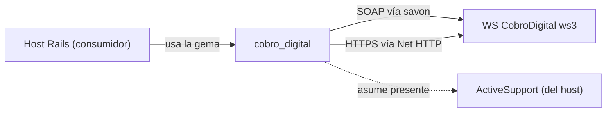

# Topología — cobro_digital

> meta: artefacto · RFC-006 · generado arch-structure · anclado a 45e32b7 · cobertura total de deps declaradas

## 1. Resumen

Gema-adaptador de un solo salto: el consumidor (host Rails) la usa para hablar con el WS externo de CobroDigital. Una dependencia de runtime (`savon`) para el transporte SOAP; el transporte HTTPS alternativo usa `Net::HTTP` de la stdlib.

## 2. §a Dependencias

| nombre | versión | rol |
|---|---|---|
| `savon` | `~> 2.12.1` | runtime — cliente SOAP hacia el WS (`Client#soap_client`) |
| `Net::HTTP` | stdlib Ruby | runtime — cliente HTTPS alternativo (`Client#https_client`) |
| ActiveSupport | no declarada | **dependencia implícita del host** — `present?`, `constantize`, `Date#strftime`/`Integer.days` en ejemplos; la gema asume que el host la provee (ver §4) |
| `bundler` | `~> 2.6.6` | desarrollo |
| `rake` | `>= 13.2.1` | desarrollo |

## 3. §b Grafo

## 4. §c Modos de ejecución / transporte

| modo | cómo se elige | cliente |
|---|---|---|
| SOAP (default) | `client_to_use = 'soap'` si no se pasa `:con_client` | `savon` → `webservice_cobrodigital` |
| HTTPS | `con_client: CobroDigital::HTTPS` | `Net::HTTP` con `http_method` `Post`/`Get` |

## 5. Cobertura y fronteras

- **Cobertura:** total sobre las deps declaradas en `cobro_digital.gemspec` + las implícitas detectadas en `lib/**`.
- **Inferencia (a verificar):** ActiveSupport es dependencia real no declarada en el gemspec. `Client#initialize` usa `attrs[:con_client].present?` y `Client#https_client` usa `constantize`; los ejemplos del README usan `Date.today + 10.days`. Si el host no carga ActiveSupport, la gema rompe. Evaluar declararla en el gemspec o eliminar el acoplamiento.
- **Sin `Gemfile.lock` versionado:** las versiones resueltas dependen del host; solo el pin del gemspec es contrato.
